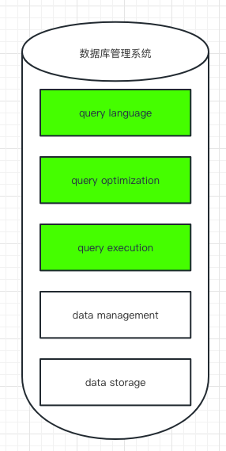
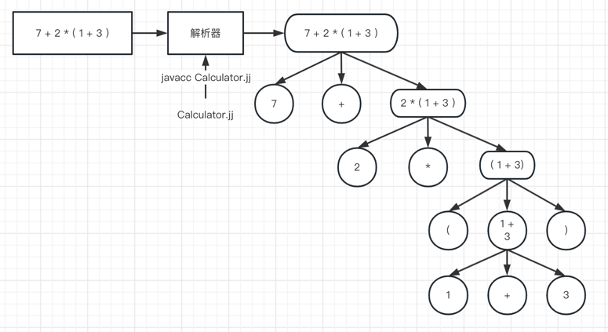
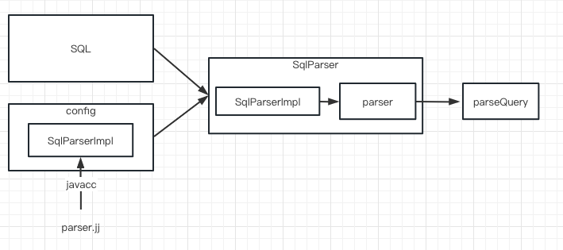
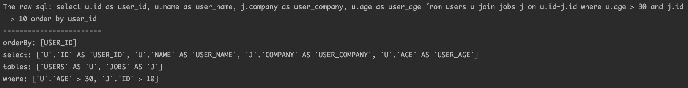
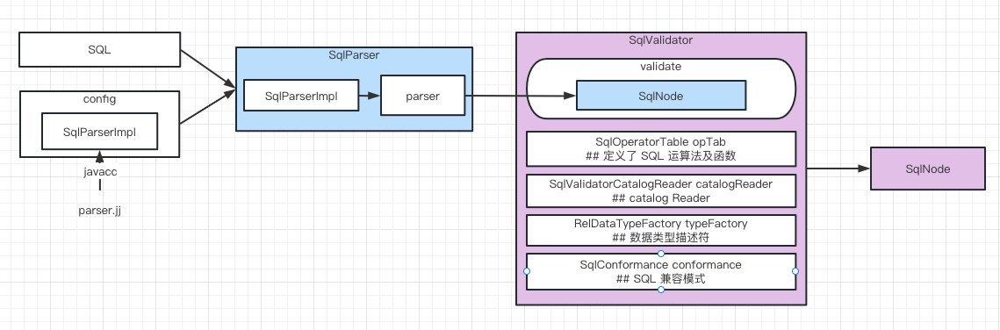
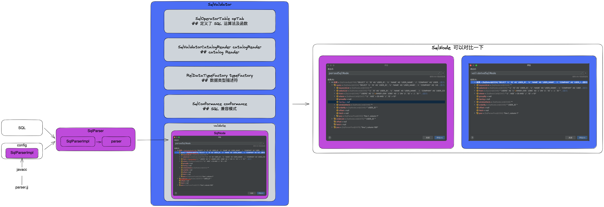
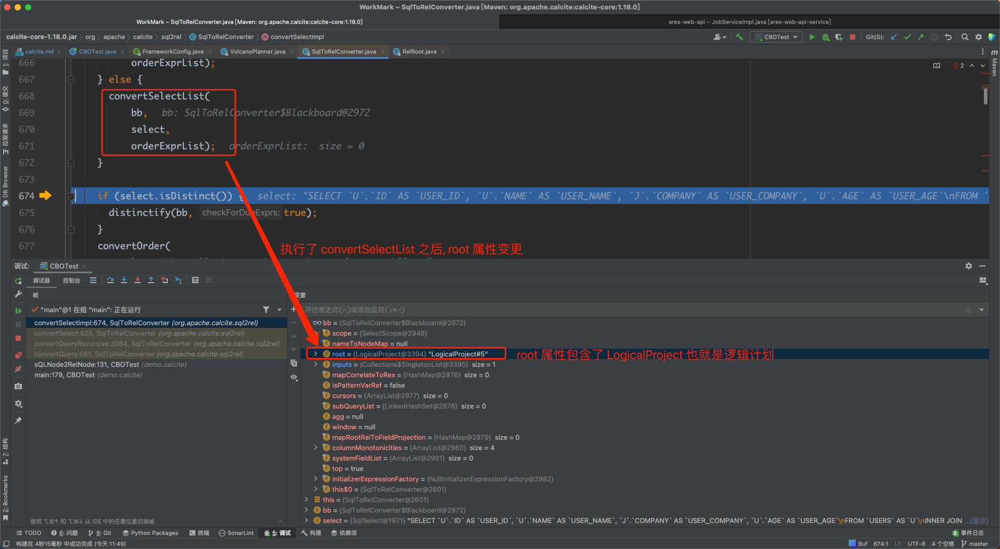
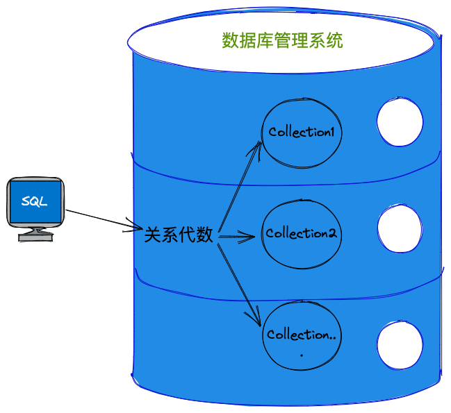

# [calcite](https://calcite.apache.org/)

`The foundation for your next high-performance database.`

1. Standard SQL: 行业通用的 SQL 解析 与 验证.
2. Query optimization: 以关系代数表示查询, 基于 RBO 和 CBO 两种规则对关系表达式进行优化.
3. Any data, anywhere: 连接第三方数据源, 元数据.

# calcite 的意义
`calcite 对我有什么意义? 流行在哪? `


在一般的数据库管理系统中, 涉及这 5 个模块, calcite 专注于绿色的 3 个模块.

# 处理流程
`calcite 如何贯穿了整个查询过程?`


1. 解析 SQL, 把 SQL 转换成为 AST(抽象语法树), 在 Calcite 中用 SqlNode 来表示;
2. 语法检查, 根据数据库的元数据信息进行语法验证, 验证之后还是用 SqlNode 表示 AST 语法树;
3. 语义分析, 根据 SqlNode 及元信息构建 RelNode 树, 也就是最初版本的逻辑计划(Logical Plan);
4. 逻辑计划优化, 优化器的核心, 根据前面生成的逻辑计划按照相应的规则(Rule)进行优化;
5. 物理执行.

# java DOC

Demo 基于 1.18.0 [DOC](https://javadoc.io/doc/org.apache.calcite/calcite-core/1.18.0/overview-summary.html)

### Parser

`Calcite 使用 javacc 做 语义 词义 解析.`

##### [javacc](https://javacc.github.io/javacc/)

`Java Compiler Compiler (JavaCC) is the most popular parser generator for use with Java applications.`

javacc 是一个 语法词法 解析器的生成器, 是个 **生成器**, 生成完整的一套解析工具, 解析过程的本质也是利用 正则.

* 语法解析: parsing
* 词法解析: 
  * 将每一个字符串解析成一个个标识符(Token)
  * 例: c 语言解析成 token 

以一个四则运算表达式为例, 了解 javacc 如何参与到解析过程


1. [.jj](./javacc/Calculator.jj) 文件;
   1. jj 文件的编写过程是思路的实现, 画清楚 **语法树** 是帮助理清思路的重要方法.
2. ```javacc xx.jj```
3. 生成工具类 
4. 四则运算计算器使用[入口](./javacc/test/Test.java)

有了四则运算的例子, 可以深入了解 calcite 的 [Parser.jj](https://github.com/apache/calcite/blob/master/core/src/main/codegen/templates/Parser.jj)

##### calcite 的 parser 过程

```java
public class Test {
    public static SqlNode parse(String sql) {
        SqlParser parser = SqlParser.create(sql, SqlParser.Config.DEFAULT);
        return parser.parseStmt();
    }

    public static void main(String[] args) {
        SqlNode sqlNode = Test.parse("");
        System.out.println(sqlNode.toString());
        // accept 访问者模式
        sqlNode.accept(SqlVisitor < R > visitor);
    }
}
```

以 [CBOTest](./CBOTest.java)._parse()_ 为例

解析过程: 

解析结果: 

结合 [Visitor](./Visitor.java)([访问者](../../mark/设计模式.md)设计模式): 

### Validate

通过上面的 Parser 过程会生成一个 SqlNode 对象, 接下来对它进行语法检查阶段, 语法检查的前提就是元数据(表名, 字段名, 字段类型, 函数名...)

结合 [calcite java doc - 1.18.0](https://javadoc.io/doc/org.apache.calcite/calcite-core/1.18.0/overview-summary.html) 
与我们的调用代码 [validate](./CBOTest.java)._validate()_ 看一次验证的过程

通过验证器的构造函数, 发现 SqlNode 验证的就是 SQL 运算符(函数)/catalog/数据类型/SQL 兼容模式

验证过程: 

验证结果: 特意写错字段名字测试一下 

### Parser & Validate 总结:



### Optimize

关于优化我们直接查看代码: [**CBOTest**](./CBOTest.java)._relNodeFindBestExp()_.

那么 planner.findBestExp() 是怎么完成优化的呢?

`Finds the most efficient expression to implement the query given via RelOptPlanner.setRoot(org.apache.calcite.rel.RelNode).`

也就是优化器我们指定 root 一个 RelNode 便可以寻找最高效解析器了.

这一部分中我们需要两个对象, 
1. [**RelNode**](https://javadoc.io/doc/org.apache.calcite/calcite-core/1.18.0/org/apache/calcite/rel/RelNode.html)
2. [**Planner**](https://javadoc.io/doc/org.apache.calcite/calcite-core/1.18.0/org/apache/calcite/plan/volcano/VolcanoPlanner.html)

对应的问题:
* Q1: 那么 RelNode 是什么? 在上一 part 中, 我们都是对 SqlNode 进行操作(Parser/Validate), 现在我该如何提供 RelNode? SqlNode 是否可以又是如何转换为 RelNode? 
* Q2: 如何创建一个 Planner? Planner 是如何 findBestExp() 的? 

##### 语义分析
`这里专门解释上面的 Q1`

那么是如何完成转换的过程? 通过[搜索](https://www.google.com/search?q=sqlnode+relnode+calcite) 我们可以找到这样的文档: 

[SqlToRelConverter](https://javadoc.io/doc/org.apache.calcite/calcite-core/1.18.0/org/apache/calcite/sql2rel/SqlToRelConverter.html):
Converts a SQL parse tree (consisting of SqlNode objects) into a relational algebra expression (consisting of RelNode objects).

* SqlNode: A SqlNode is a SQL parse tree.
* RelNode: A RelNode is a relational expression.
* RexNode: Row expression.

SqlNode -> RelNode/RexNode, 这步我们称为语义分析, 也是生成逻辑计划(Logical Plan)的过程.

结合 [**CBOTest**](./CBOTest.java)._sQLNode2RelNode()_ 我们来看 SqlNode -> RelNode 的过程.

1. org.apache.calcite.sql2rel.SqlToRelConverter.convertQuery: Converts an unvalidated query's parse tree into a relational expression.
2. org.apache.calcite.sql2rel.SqlToRelConverter.convertQueryRecursive: Recursively converts a query to a relational expression.
3. org.apache.calcite.sql2rel.SqlToRelConverter.convertSelect: Converts a SELECT statement's parse tree into a relational expression.
4. org.apache.calcite.sql2rel.SqlToRelConverter.convertSelectImpl: 真正实现 convertSelect, 逐渐执行:
   1. convertFrom
   2. convertWhere
   3. convertSelectList
   4. ... ...
5. 上面执行的这些 convertXXX 操作就是在生成 LogicalProject 逻辑计划 
6. 最终我们生成的 

##### 优化的根本: 关系代数

`这里专门解释上面的 Q2`

`
关系代数是关系型数据库操作的理论基础, 同样也是 calcite 优化模块的核心, 我们常说的 SQL 也仅仅是关系代数运算的一种常用的实现方式而已(并不是唯一方式); 
在 calcite 中会将 SQL 转换成关系表达式, 然后通过规则匹配对关系表达式进行优化. 也是一个分层思想的体现.
`



SQL -> 关系代数 -> 优化关系表达式

##### 优化器(Planner)的实现

* 基于规则的优化(Rule-Based Optimizer，RBO)
    * 根据优化规则对关系表达式进行转换, 这里的转换是说一个关系表达式经过优化规则后会变成另外一个关系表达式, 同时原有表达式会被裁剪掉, 经过一系列转换后生成最终的执行计划.
    * RBO 的实现: HepPlanner
* 基于成本的优化(Cost-Based Optimizer，CBO)
    * CBO 的实现: VolcanoPlanner

无论 RBO or CBO, 都遵循着同样地优化准则:

1. 谓词下推 Predicate Pushdown
2. 常量折叠 Constant Folding
3. 列裁剪 Column Pruning
4. 其他

### Execute

