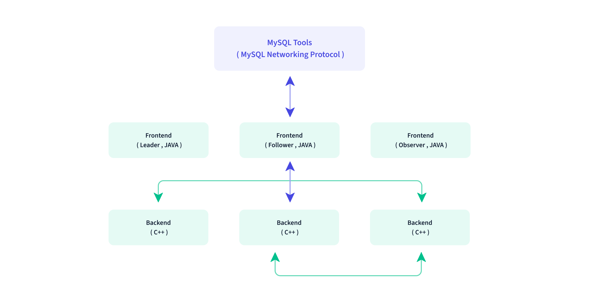
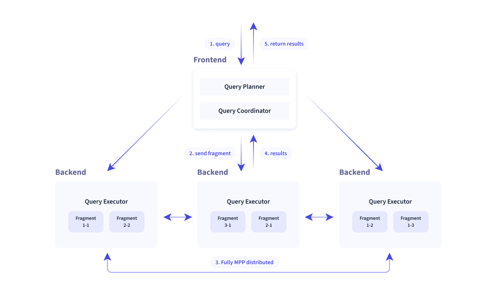

# [Apache Doris](https://doris.apache.org/zh-CN/)
`简单易用、高性能和统一的分析数据库`
## [学习路径](https://doris.apache.org/zh-CN/learning)
* 快速开始
  * [Apache Doris 总体介绍](doris.md#apache-doris-总体介绍)
* 数据表设计
  * 数据模型
  * 数据划分
  * 建表指南
  * Rollup 与 查询
  * 建表实践
  * 索引
* 数据导入
  * 导入总览
  * 导入本地数据
  * 导入外部存储数据
  * 订阅 kafka 日志
  * 通过外部表同步数据
* 数据导出
  * 导出数据
  * 导出查询结果集
  * 导出表结构或数据
  * 数据备份
* 数据更新及删除
  * 数据更新
  * 删除操作
  * 批量删除
  * Sequence 列
* 进阶使用
  * 表结构变更
  * 动态分区
  * 数据缓存
  * Join 优化
  * 物化视图
  * BITMAP 精确去重
  * HLL 近似去重
  * 变量
  * 时区
  * 文件管理器
* 生态拓展
* SQL 手册
  * SQL 函数
  * DDL
  * DML
  * 数据类型
  * 辅助命令
* 集群管理
## Apache Doris 总体介绍
### Doris 介绍
1. Apache Doris 是一个基于 MPP 架构的高性能、实时分析数据库，极速、易用，支持高并发点查询，也支持高吞吐量的复杂场景。
2. Apache Doris 前身是百度广告报表的 Palo 项目，2017 开源，2018 捐赠给 Apache，2022 毕业，成为 TLP（Top-Level Project）。
### 使用场景
1. 报表
2. adhoc 查询
3. 统一数仓构建
4. 数据湖联邦查询
### 技术概述
1. 只有两类进程 
   1. Frontend(FE)，主要负责用户请求的接入、查询解析规划、元数据管理、节点管理。
   2. Backend(BE)，主要负责数据存储，查询计划的执行。
2. 在使用接口方面：Doris 采用 MySQL 协议，高度兼容 MySQL 语法，支持标准 SQL。
3. 在存储引擎方面，Doris 采用列式存储。
4. 在索引结构上，支持：
   1. Sorted Compound Key Index，可以最多指定三个列组成复合排序键，该索引可以有效进行数据裁剪更好地支持并发的报表场景。
   2. Z-order Index：该索引可以高效对数据模型中的任意字段组合进行范围查询。
   3. Bloom Filter：对高基数列的等值过滤裁剪非常有效。
   4. Invert Index：对任意字段实现快速检索。
5. 在存储模型上，Doris 支持多种存储模型，并分别对场景优化：
   1. Aggregate Key 模型：相同 Key 的 Value 列合并，通过提前聚合大幅提升性能。
   2. Unique Key 模型：相同 key 的数据覆盖，实现行级数据更新。
   3. Duplicate Key 模型：明细数据模型，满足事实表的明细存储。
6. Doris 也支持强一致的物化视图，物化视图的更新和选择都在系统内自动进行，不需要用户手动选择。
7. 在查询引擎方面，Doris 采用 MPP 模型，节点之间可以并行执行，也支持多个大表分布式 Shuffle Join。
8. 向量化查询引擎，所有的内存结构能够按照列式布局，可以大幅减少虚函数调用、提升 Cache 命中率。
9. 采用 Adaptive Query Execution 技术，可以根据 Runtime Statistics 来动态调整执行计划。
10. 在优化器方面，将 CBO 和 RBO 结合；目前 CBO 还在优化中。
### QA
1. 什么是 MPP 架构？大规模并行处理，首先将数据分散在不同节点，每个节点有自己的资源（CPU、内存、IO），当一个任务到来时，拆分成多个任务后并行的分散到多服务器的节点上，每个节点计算之后汇总到一起。
2. 什么是向量化查询引擎？
3. 什么是物化视图？
