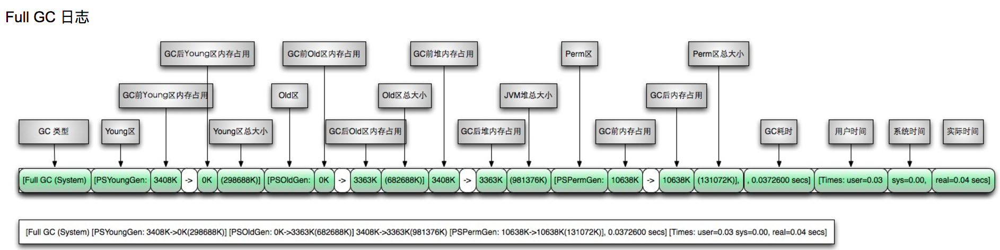

1. 在 [Java Virtual Machine Specification](https://docs.oracle.com/javase/specs/jvms/se8/html/) 中, 搜索 heap,
   就会发现 
2. 在第二章, 有一个 Run-Time Data Areas, 其中定义了:
    1. The pc(program counter) Register(程序计数器)
    2. Java Virtual Machine Stacks(JVM 栈)
    3. Heap(堆)
    4. Method Area(方法区)
    5. Run-Time Constant Pool(运行时常量池)
    6. Native Method Stacks(本地方法栈)

`到这, 可能很多人懵了, 诶, 怎么定义了 6 个区域呢, 网上明明写着 5 个呢? 其实是: 因为这个运行时常量池是保存在方法区中的, 所以很多人都用方法区来概括这个运行时常量池`

3. 规范由 Oracle 定义了, 总得实现这套规范, 谁实现的呢? **HotSpot** 那么我们说的这些 永久代 老年代 这些, 都是 HotSpot 的实现. 不要和 JVM 虚拟机规范混为一谈.
4. HotSpot 如何实现 JVM 规范:  其中堆和方法区是线程共享, 其他均为线程私有.
    1. 堆区: HotSpot 使用新生代(Eden区, From Survivor, To Survivor) 老年代来实现堆区, 新生代：老年代=1：2，新生代：包括Eden，From S，To
       S区，比例是8：1：1，对象都会再Eden区创建出来的，E满了之后进行一次轻GC，存活对象放入到F，这个阶段相当于E与F协同，当F满了之后对E与F进行轻GC，存活对象存放到T，这个阶段变成了E与T区协同工作，当一个对象经过15次GC还没有消亡，就存放老年代，老年代满了就进行Full
       GC，Full是对整个堆空间进行的GC； Survivor的存在意义，就是减少被送到老年代的对象，进而减少Full GC的发生 设置两个Survivor区最大的好处就是解决了碎片化
    2. 方法区: 类的元数据, 构造函数, 是接口还是 class, 加载器是哪个...
    3. JVM 栈: 随着线程的创建, 便创建出栈帧, 放入到 JVM 栈中, 栈帧中存放着局部变量 操作树栈 方法出口等.
    5. 本地方法栈: Native 方法的运行空间.
    4. 程序计数器: 每个线程都有自己的程序计数器.
5. JVM 中定义的方法区, 在不同版本 jdk 的实现是不同的, jdk7 是通过永久代来实现的, jdk8 废除永久代使用元空间来实现.
    1. jdk8 的特点不仅仅只是改成了元空间这个名字而已, 重要的是对方法区的实现, 改成了使用堆外内存来保存类的元数据(schema), 这么做的好处就是: 尽可能的利用堆外内存, 以降低堆内内存的使用, 以达到减少 GC 次数的优点. 
6. HotSpot 除了实现内存的规划, 还有对字节码(Class 文件)加载的实现, 我们常说的 加载过程 和 双亲委派模型就是在这里实现的:
    1. 加载过程
    2. 双亲委派模型：
        1. 首先类加载器是有一个类似 继承 关系的概念, Application ClassLoader -> Extension ClassLoader -> Bootstrap ClassLoader,
           每个类加载器负责一个指定目录下的类库加载.
        2. 在这个模型中, 有一个核心思想就是，如果可以用父类加载器，那就用父类加载器, 只有父类加载器无法完成家在请求, 才向下传递.
    3. 双亲委派的意义: 避免重复加载 & 沙箱保护机制, 比如我们自己定义一个 String 类, 实现一个 main 方法, 最终被加载的其实是 java.lang.String, 而这个 String 类是没有 main
       函数的.
7. 有了加载, 就得有回收, 如何判断对象可以回收?
    1. 引用计数法(已废弃), 先声明!!! 引用计数是可以通过 Recycler 算法解决, 但是多线程场景下, 实现过于复杂, 性能较低, 已经不具备深入研究的条件了.
    2. 可达性分析(根引用), 从 GcRoot 向下染色, 便可以得到哪些对象有引用, 哪些没有, 虚拟机则对应判断是否回收. 其中 GcRoot 包含了:
        1. JVM 栈 本地方法栈 中引用的对象
        2. 方法区中常量和静态属性引用的对象
    3. 不同类型引用:
        1. 强引用, 平时常用的 new 对象创建出来的都是强引用, 意味着宁愿 OOM 也不要回收.
        2. 弱引用, 只要 GC 就回收弱引用对象
        3. 软引用, 当发现快要 OOM 时, 回收软引用
        4. 虚引用, 随时可以回收
8. 上面判断了哪些对象可以回收之后, 垃圾回收算法都有哪些呢?
    1. 标记清除: 一个染色过程, 就是 GcRoot 向下染色, 首先标记, 之后统一回收, 这个过程效率并不高, 并且伴有内存碎片化的问题出现.
    2. 复制算法: 把内存一分为二, 比如 ab 两个区域, 使用其中一部分a, 然后将存活的对象复制到另外一部分b, 然后整体清除a. 目前新生代的垃圾回收大多选择此种算法. 因为大多数新生代的对象都是快速消亡的, 所以使用一块大的
       Eden 加上两个 Survivor 的模型.
    3. 标记整理: 也是先标记对象, 但是后续并不是立即清除, 而是将所有存活对象向下一段内存空间移动, 然后清除这段内存空间边界外的区域. 老年代大多采用此类算法.
    4. 目前虚拟机使用的是分代收集, 不同代适用于不同的回收方式, 新生代存活率低, 使用复制算法, 清除高效. 老年代存活率高, 要节省内存的利用, 没有额外的空间进行分配, 所以标记清除或者标记整理.
9. 有哪些垃圾回收器?
    1. 在 G1 之前呢, 有 7 种回收器, 分别对应不同代的内存回收场景
        1. 不管哪个回收器, 都离不开这几种类型, 单线程、并行、并发回收器.
        2. 并行: 多个回收线程一起工作, 此时用户线程全部等待.
        3. 并发: 回收线程与用户线程同时执行.
    2. 详细解释下 CMS: **并发** 的 **标记-清除** 过程:
        1. 初始标记：STW 来标记出来 GCRoot.
        2. 并发标记：GCRoot tracing, 一个染色过程.
        3. 重新标记：因为是一个并发模型, 在上面的染色过程中, 可能会掺杂进来用户的工作线程, 所以需要二次染色.
        4. 并发清除：开启用户线程，同时GC线程开始对为标记的区域做清扫.
        5. 那么 CMS 的问题在哪?
            1. 碎片化, 标记-清除 在所难免.
            2. 模型设计引起的性能问题, 比如 Concurrent Mode Failure(CMS GC期间, 老年代的空间不足以分配给新生代, 此时有个退化处理, 会影响到 GC 性能).
    3. 详细解释下 G1: 特点是并发与并行
        1. G1的目标就是: 利用多核减少 STW 的时长, 小区域收集 + 形成连续的内存块（避免内存碎片）
        2. 首先看看 G1 的回收模型: 不同于其他的回收器将堆分成了各种代, 取而代之的是 G1 管理了整个堆区的回收, 将堆区分割不同的区域, 可能第一块是Eden，第二块是Survivor(幸存区), 第三块是老年代,
           第四五六块可能就是大对象. 类似于棋盘一样, 然后并发操作.
        3. G1 的回收步骤是怎么样的? 这个回收过程是围绕目标进行的, 其中一个目标就是形成连续的内存块, 一起都移动到一个小格子里成为一个新的S区，而且这个S区的位置集中这样可以避免内存碎片;
        4. G1还有一个牛逼的地方，可以设置期望停顿的时间；
10. GC 分析, 在 JVM 参数优化之前, 需要拿到 GC 日志, 之后分析是否需要 JVM 优化, 之后是优化.
    1. 拿到 GC 日志:
        1. `$ jstat -gc 1262`
        2. 但是上面的命令是我们主动捞取 GC 日志, 而真正有问题的时间点我们可能错过, 所以也可以设置间隔指定时间获取日志 `$ jstat -gc 1262 2000 20` 每隔2000ms输出 1262 gc 情况,
           一共输出20次.
        3. 仍然可以把这些命令设置到启动命令中.
    2. 分析日志:
        1. 不同类型的 GC 日志不同, 但是日志中大体都包含了: GC 类型/作用在什么区/回收之前空间/回收之后空间/耗时/用户时间...
        2. 
        3. 
        4. 当然了, 大家还是更多的借用可视化工具完成日志的分析: JProfiler
    3. 优化 JVM: 那么在什么场景我们才需要优化?
        1. 两大核心指标 **延迟** **吞吐量**
        2. 延迟: 最大停顿时间, 目前 GC 的发展方向也是 可以接受一定程度的频次增加 来降低单次 GC 的 STW 的时间.
11. GC 事件类型分析?
    1. 一般我们分成三类, Minor GC（小型 GC, Young GC）/ Major GC（大型 GC, Old GC）/ Full GC（完全 GC）
       1. Minor GC（小型 GC）: 针对新生代
       2. Major GC（大型 GC）: 清理老年代的 GC
       3. Full GC: 作用整个堆 方法区.
    2. GC 的触发原则很简单, 哪个区域空间不足了, 则回收, 这个不足可以从两个角度解读,
    3. 什么时候会 FullGC?
        1. 如果 老年代剩余空间不足够 young GC 之后的晋升空间, 那么就需要 full GC, 因为此刻需要做两件事情, youngGC 和 oldGC, 所以干脆就 fullGC 吧.
        2. 方法区需要 GC 时候, 也是 FullGC, 但是!!!jdk8 之后方法区使用堆外内存, 基本不触发 FullGC. 但是有人会给方法区设置空间大小.
        3. 显示调用 System.gc()
        4. 那 Full GC 有什么特点? 为什么会有人单独问什么时候 Full GC?
            1. FullGc 的 STW 时间较长
12. 线上调优经验:
    1. 一般经验都围绕在设置最大 -Xms -Xmx, 来设置 JVM 堆的大小; 因为我们是容器么, 如果不指定 XMS XMX java 进程会读取物理机内存, 导致默认设置的堆大小远远高于我们设置的容器内存, 最终容器超卖.
    2. 这里特意说下 Xms Xmx  这是堆大小, 而不是进程大小
    3. 有些时候会增大堆内存, 比如报出来 OOM 的问题
    4. 有些时候会减小内存, 比如我们报警, 内存利用率过高, 这个计算公式是: XMX(最大堆内存) + 堆外内存 + jvm 栈内存/ 容器设置内存, 可能这时候很多人会立即增加内存, 但是我真正的经验告诉,
       这一部分内存利用率过高有可能是元空间导致的, 这个时候应该减少堆内存, 以达到增加堆外空间的效果. 而且还要关注 线程数量 来得到栈内存.
    5. 剩下的与 JVM 有关的命令我们基本没有动
    6. 没动并不是不动, 而是要关注 JVM 的性能指标, 也就是 延迟 吞吐量
    7. 在接下来可能跟 进程权限 或者 gc 日志有关的配置, 比如你需要某个进程 Attach 到你的进程上 
    8. 但是绝对 或者 基本绝对 不要去动什么
13. jdk8 使用的什么回收器?
    1. 其实应该是 新生代:ParNew GC + 老年代:CMS

写在最后:

1. 参考: [美团技术团队](https://tech.meituan.com/2020/11/12/java-9-cms-gc.html)
