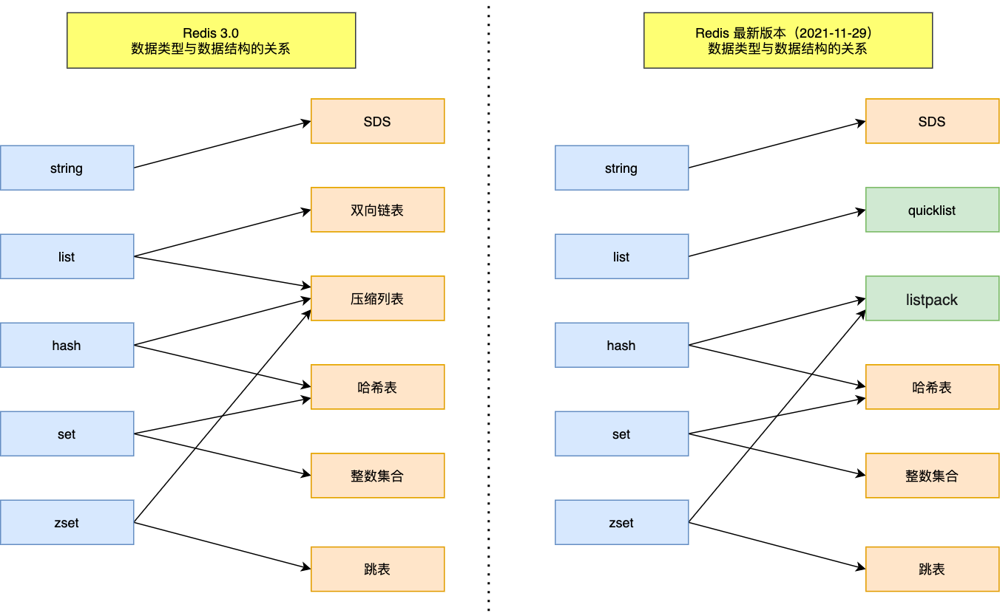
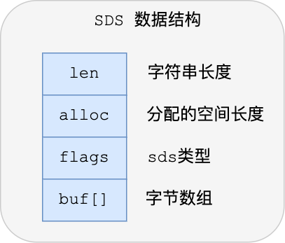
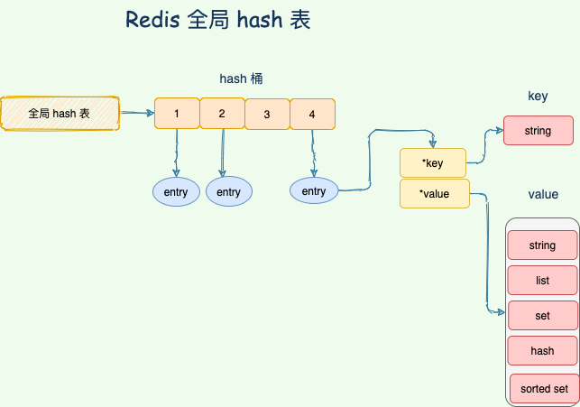

# 核心问题: Redis 为什么快?

`KV 内存 单线程? 别忘了数据结构`
`单机 10w QPS`

## 基于内存

## 数据类型

1. String
2. List: 消息队列, 列表场景
3. Set
4. Hash
5. SortedSet

## 数据结构

**⚠️⚠️⚠️ 写在最前, 数据结构不同于数据类型, 在 Redis 中, 这些数据类型的实现是由多重数据结构组合完成的, 不要把结构和类型混为一谈**

`基本上我们就是 9 种数据结构, SDS zpiList quickList linkedList hash...`

1. String: SDS 简单动态字符串
    1. 
    2. 除了字符串本身, 还保存了额外信息, 比如 len, free
    3. 空间预分配, SDS 被修改后, 除了分配必须空间, 还会分配额外空间
    4. 惰性空间释放, 对 SDS 缩短, 并不会回收多余的内存, 而是使用 free 来保存这些空间不释放, 之后如果 append 则直接使用 free 中的空间
    5. 两种编码格式, embStr/raw 编码, 根据字符串长度选择, 默认使用 embStr 为了占用连续内存.
2. zipList:
    1. 本质是通过字节数组实现的, 为什么用数组实现链表? 是因为我们一般实现链表都会使用到指针, 这样会占据额外的内存空间, 引起内存碎片, 所以使用数组占用完整的一块内存.
    2. 缺点就是担心连锁更新的可能. 所以适用于少量数据的场景.
    3. 是 list hash sortedSet 类型的底层实现结构之一.
3. zipList 之后的升级: quickList 和 listPack
    1. quickList
    2. 
    3. 是 zipList + linkedList 的合体
4. 哈希表
5. skipList 跳表, 为了时间复杂度: O(logN)
    1. 
    2. 有序 层级的数据结构, 增加多层级索引, 通过索引位置的几次跳转, 实现数据的快速定位
    3. 比如 12345, 第一层保存 1, 第二层保存 134, 第三层保存 12345, 然后每个节点都保存着相邻的指针
    4. 同时, 各个节点之间, 保存了一个属性, 叫 跨度. 来保存节点之间的距离.

## 单线程模型

1. 单线程**仅仅**是指 KV 读写的过程是单线程的.
2. 越是读写快(利用内存)的场景, I/O 越快, 多线程模型越是不利.

## I/O 多路复用

epoll 模型是基于事件驱动, 利用多路复用的特性, 减少在等待 I/O 处理时的时间.

## Redis 的 KV 模型

## 持久化

`RDB AOF`

1. RDB 是快照的形式，完成数据的备份据保存到 *.rdb 文件中，这个文件是个二进制文件。
    1. RDB 的实现策略有两种形式, save 与 bgSave(backgroundSave).
    2. bgSave 的实现方式: 当需要持久化时, fork 一个子进程, 新的进程负责全程的写入, 之后替换掉原来的 rdb 文件. 实现 copy-on-write.
2. AOF 是把所有对 Redis 的修改的命令都存到一个文件里，当持久化的时候读取的时候这个文件。
    1. AOF 同步有三种策略, yes always(数据变更则同步) everySec(指定秒数同步).
    2. AOF 的缺点就是文件较大, 上面的 rdb 只是一个二进制文件, 但是 AOF 则是一个文件内保存了较多的字符串.

## 数据清理策略

1. 惰性删除(获取时候判断是否需要删除)(主要目标是节省 CPU 资源, 因为是单线程的, 但是非常浪费内存) + 定时删除(解决惰性删除浪费内存的问题)

## 淘汰机制

1. 一共 8 种可以聚合分为 4 种, LRU(最少使用) 最小频率 随机 TTL

## 分布式锁

1. 先了解 set
    1. setEx: set expire key, 有过期时间
    2. setNx: set not exist, 有返回值的 set key
2. 看业务场景, 不重要的应用可以使用 redis 实现
    1. setNx
    2. expire key
    3. delete key
    4. 后来 redis 也有新的命令, set key value ex px nx, ex: expire, px: 毫秒 nx: 键 notExist 时存入, xx: 键 existExist 时存入, 就是把一堆 set
       命令变成了一次 pipeline 操作
    5. 至于 什么 lua 脚本的, 就扯淡了, 建议直接换 zookeeper 或者 etcd

## 雪崩 穿透 击穿

1. 雪崩：所有key的失效时间都是12小时，那如果这时候来了大量请求，相当于redis什么作用都没有。
    1. 设置key失效时间都加个随机值
    2. 既然跟key失效有关，那我key不失效不就得了，去主动更新redis的数据而不是用redis自动失效
2. 穿透：缓存与数据库中都没有的数据，但是用户还在不断的请求。想这种穿透了redis去给我mysql压力，就叫穿透。
    1. 参数校验
3. 一个key非常热点，不停的扛着大并发，当这一个key失效瞬间，就是大量的请求都到了我数据库
    1. 可以自己服务端缓存, 利用 Redis 的消息通知, 把 Redis 的服务端数据同步给客户端, 同样包含变更操作.