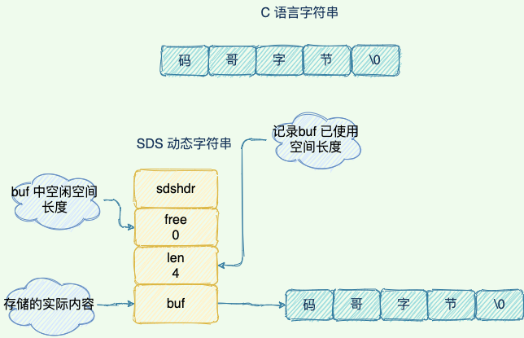

#核心问题: Redis 为什么快?
`KV 内存 单线程? 别忘了数据结构`
`单机 10w QPS`
## 基于内存

## 数据结构
`5 种数据类型, String List Set Hash SortedSet`
不同的数据类型都有多种数据结构的支持, 就是为了快. 注意: 数据类型与数据结构不一样!!! 别混了.

1. SDS 简单动态字符串
   1. 
   2. 除了字符串本身, 还保存了额外信息, 比如 len, free
   3. 空间预分配, SDS 被修改后, 除了分配必须空间, 还会分配额外空间
   4. 惰性空间释放, 对 SDS 缩短, 并不会回收多余的内存, 而是使用 free 来保存这些空间不释放, 之后如果 append 则直接使用 free 中的空间
   5. 两种编码格式, embstr 编码, raw 编码, 默认使用 embstr 为了占用连续内存.
2. zipList
   1. 是 list hash sortedSet 类型的底层实现结构之一.
   2. 数据量较小, 或者单条数据长度较小 时使用.
3. quickList
   1. 
   2. 是 zipList + linkedList 的合体
4. skipList 跳表
   1. 
   2. 有序 层级的数据结构, 增加多层级索引, 通过索引位置的几次跳转, 实现数据的快速定位
   3. 比如 12345, 第一层保存 1, 第二层保存 134, 第三层保存 12345, 然后每个节点都保存着相邻的指针
## 单线程模型
1. 单线程**仅仅**是指 KV 读写的过程是单线程的.
2. 越是读写快(利用内存)的场景, I/O 越快, 多线程模型越是不利.
##I/O 多路复用
epoll 模型是基于事件驱动, 利用多路复用的特性, 减少在等待 I/O 处理时的时间.
##Redis 的 KV 模型

##持久化
`RDB AOF`
1. RDB 是快照的形式，完成数据的备份据保存到 *.rdb 文件中，这个文件是个二进制文件。
   1. RDB 的实现策略有两种形式, save 与 bgSave(backgroundSave).
   2. bgSave 的实现方式: 当需要持久化时, fork 一个子进程, 新的进程负责全程的写入, 之后替换掉原来的 rdb 文件. 实现 copy-on-write.
2. AOF 是把所有对 Redis 的修改的命令都存到一个文件里，当持久化的时候读取的时候这个文件。
   1. AOF 同步有三种策略, yes always(数据变更则同步) everySec(指定秒数同步).
   2. AOF 的缺点就是文件较大, 上面的 rdb 只是一个二进制文件, 但是 AOF 则是一个文件内保存了较多的字符串.
## 数据清理策略
1. 惰性删除(获取时候判断是否需要删除) + 定时删除
## 淘汰机制
1. 一共 8 总可以聚合分为 4 种, LRU(最少使用) 最小频率 随机 TTL
## 分布式锁
1. 先了解 set
   1. setEx: set expire key, 有过期时间
   2. setNx: set not exist, 有返回值的 set key
2. 看业务场景, 不重要的应用可以使用 redis 实现
   1. setNx
   2. expire key
   3. delete key
   4. 后来 redis 也有新的命令, set key value ex px nx, ex: expire, nx: notExist, xx:existExist, 就是把一堆 set 命令变成了一次 pipeline 操作
   5. 至于 什么 lua 脚本的, 就扯淡了, 建议直接换 zookeeper 或者 etcd
## 雪崩 穿透 击穿
   1. 雪崩：所有key的失效时间都是12小时，那如果这时候来了大量请求，相当于redis什么作用都没有。
      1. 设置key失效时间都加个随机值
      2. 既然跟key失效有关，那我key不失效不就得了，去主动更新redis的数据而不是用redis自动失效
   2. 穿透：缓存与数据库中都没有的数据，但是用户还在不断的请求。想这种穿透了redis去给我mysql压力，就叫穿透。
      1. 参数校验
   3. 一个key非常热点，不停的扛着大并发，当这一个key失效瞬间，就是大量的请求都到了我数据库
      1. 可以自己服务端缓存, 利用 Redis 的消息通知, 把 Redis 的服务端数据同步给客户端, 同样包含变更操作.