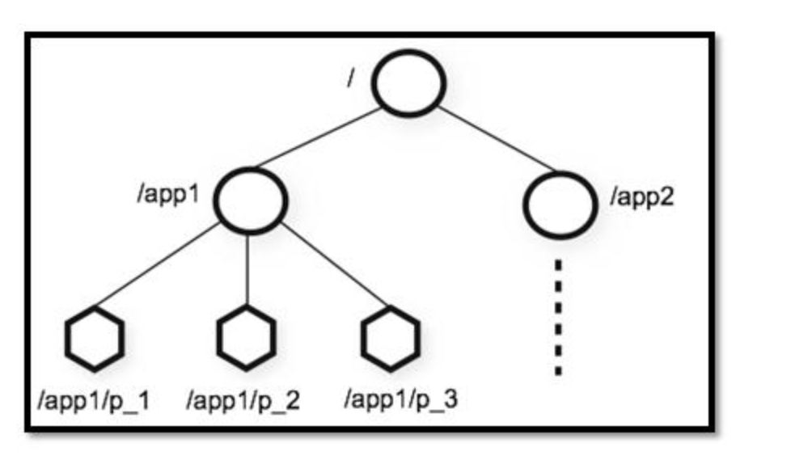
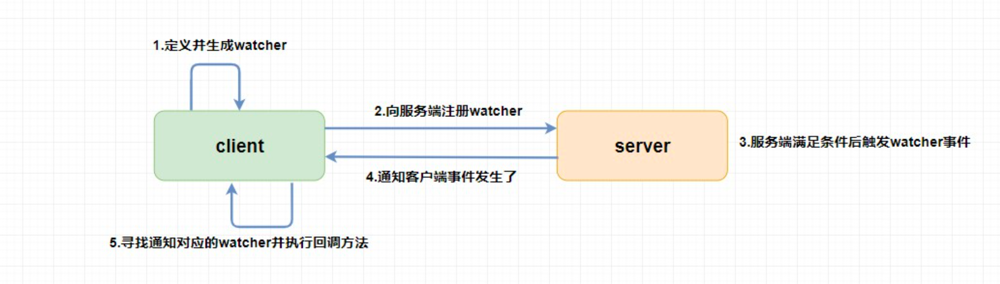

## Zookeeper 中的概念
1. 整体模型 
   1. 多叉数模型, 在每个节点保存数据
   2. 注意, zookeeper 只是用于协调, 并不是纯粹的数据库, 所以每个节点限制了存储数据量的大小为 1M
2. znode, 单个节点
   1. zookeeper 中的最小单元
   2. 有 4 种类型, 持久 临时 持久顺序 临时顺序, 这个单独解释下顺序, 比如 /node1/app0000000001 /node1/app0000000002
   3. 每个 znode 包含两个属性, stat:状态信息 data:业务内容
3. znode 的 ACL 权限, 类似 Unix 文件操作权限
   1. 增删改查 以及 Admin
4. watch 功能
   1. zookeeper 生成 watcher, 返回给客户端, 发生变化回调给客户端.
5. 集群, 一般三台服务器形成一组集群
   1. ZAB 协议保障一致性
   2. 
6. 