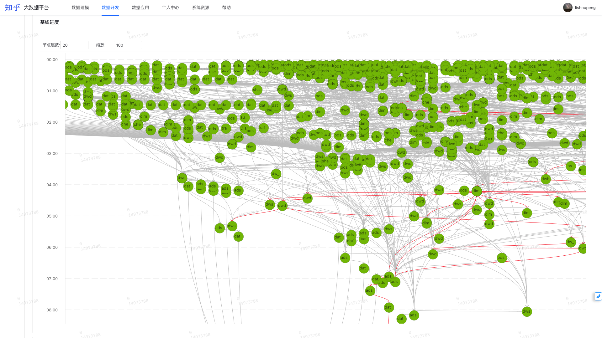

# 基线报警培训
`本次培训目标：向用户介绍基线报警，教会用户如何创建基线报警，向用户介绍如何处理基线报警，基线报警的未来。`

## 报警的现状
`报警的重要性：执行任务时，可能遇到很多问题，例如：任务失败、调度逻辑错误导致调度出错、资源不足等。如果没有及时的报警机制，这些问题可能会在不知不觉中积累，导致更大的问题。诸如：OKR SLA 任务延迟...`
### 目前是如何报警的
依靠任务配置的报警，仅有两种场景触发报警，任务失败与任务超时。

### 当前的报警有什么问题
1. 不能快速、有效、准确梳理需要监控的任务；
2. 梳理到要监控的任务，但是不知道设置几点报警；
3. 报警太多，重要报警被淹没；
4. 任务出现预警后不能快速、有效识别上游关键 block 任务；
5. 报警不及时；
6. 链路报警；
7. ...

`以上，来自于 2022 年 9 月份收集到的数仓同学反馈`

## 基线报警

### 概念
1. 保障任务
### 实现方式
以保障任务作为叶子节点，根据任务的依赖关系递归
### 基线报警具备哪些功能
1. 链路超时报警
2. 实例失败报警
3. 实例超时报警

## 基线报警的未来功能

## QA
