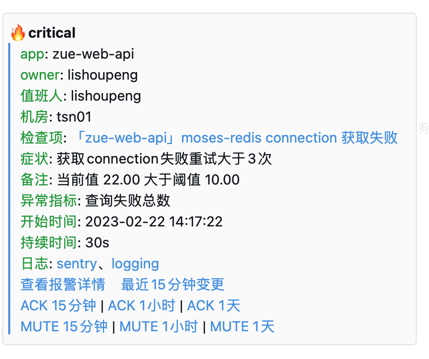
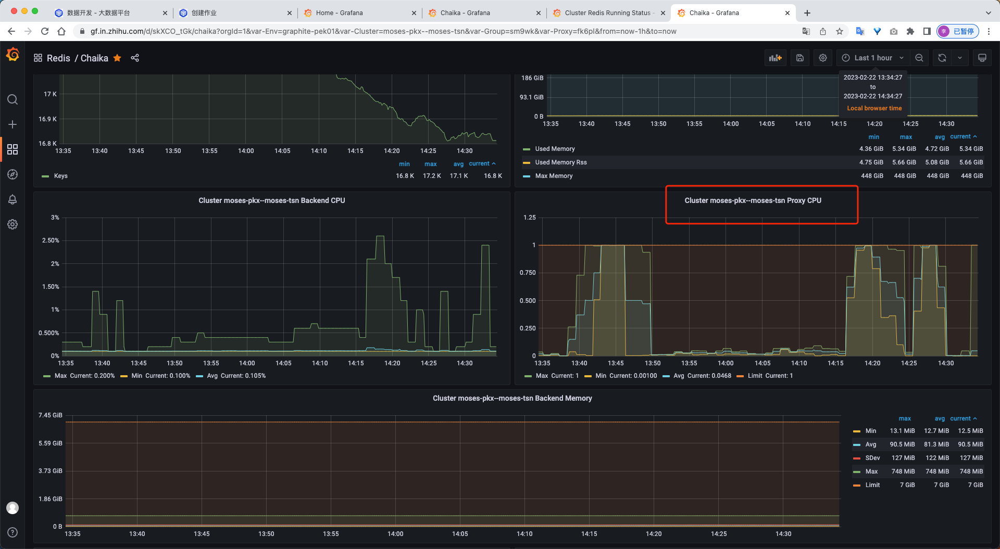
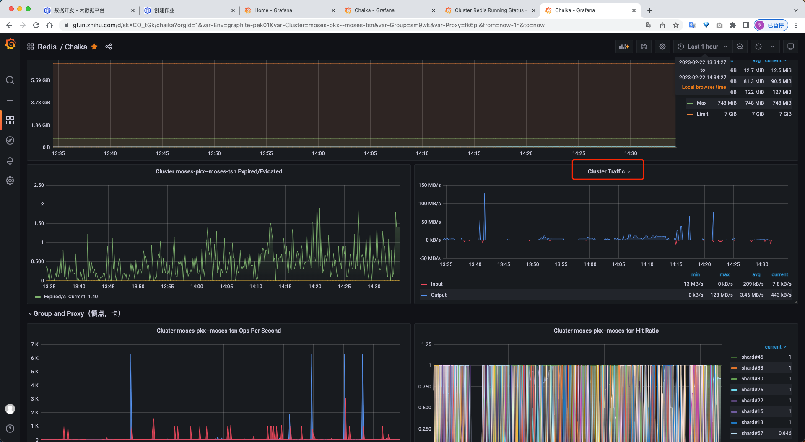

背景
1. 复现场景：adhoc 查询，我们将查询结果缓存到 redis，并且查询的内容存在知乎的文章内容类似的等大 key，用户在 adhoc 查询之后，可以把 redis 的结果下载成 excel、csv；此时报警 
2. 现场指标，redis 代理 cpu100% 
3. 现场指标，网卡流量，100M/s 
4. 由网卡流量定位原因：大 key 导致。
5. 解决办法，增加代理数量，复用 redis pipeline 查询能力，减少创建链接。