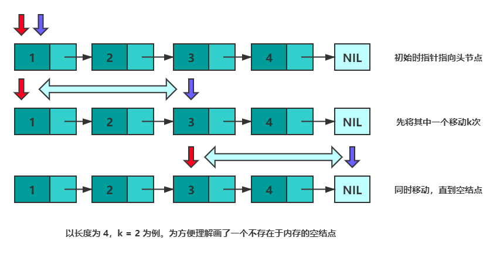

#数组与链表
`线性存储方式的两大代表: 链表和数组`

##数组
所有元素都连续的存储于一段内存中，且每个元素占用的内存大小相同。这使得数组具备了通过下标快速访问数据的能力。
但连续存储的缺点也很明显，增加容量，增删元素的成本很高，时间复杂度均为 O(n)。
增加数组容量需要先申请一块新的内存，然后复制原有的元素。如果需要的话，可能还要删除原先的内存。

删除元素时需要移动被删除元素之后的所有元素以保证所有元素是连续的。增加元素时需要移动指定位置及之后的所有元素，然后将新增元素插入到指定位置，如果容量不足的话还需要先进行扩容操作。

总结一下数组的优缺点：
* 优点：可以根据偏移实现快速的随机读写。
* 缺点：扩容，增删元素极慢。

##链表
由若干个结点组成，每个结点包含数据域和指针域。结点结构如下图所示：

一般来讲，链表中只会有一个结点的指针域为空，该结点为尾结点，其他结点的指针域都会存储一个结点的内存地址。链表中也只会有一个结点的内存地址没有存储在其他结点的指针域，该结点称为头结点。

链表的存储方式使得它可以高效的在指定位置插入与删除，时间复杂度均为 O(1)。
在结点 p 之后增加一个结点 q 总共分三步：

申请一段内存用以存储 q (可以使用内存池避免频繁申请和销毁内存)。
将 p 的指针域数据复制到 q 的指针域。
更新 p 的指针域为 q 的地址。

删除结点 p 之后的结点 q 总共分两步：

将 q 的指针域复制到 p 的指针域。
释放 q 结点的内存。

##面试问题总结
面试主要围绕链表的缺点提出问题: 
* 无法高效获取长度
* 无法根据偏移快速访问元素

例如: 倒数第k个元素, 获取中间位置的元素, 判断链表是否存在环，判断环的长度等和长度与位置有关的问题。

以上这些问题, 我们通过双指针搞定

Tips: 双指针并不是固定的公式, 而是一种思维方式.

1."倒数第k个元素的问题"。设有两个指针 p 和 q，初始时均指向头结点。首先，先让 p 沿着 next 移动 k 次。此时，p 指向第 k+1个结点，q 指向头节点，两个指针的距离为 k 。然后，同时移动 p 和 q，直到 p 指向空，此时 q 即指向倒数第 k 个结点。可以参考下图来理解：

上一部分中，总结快慢指针的特性 —— 每轮移动之后两者的距离会加一。下面会继续用该特性解决环的问题。
当一个链表有环时，快慢指针都会陷入环中进行无限次移动，然后变成了追及问题。想象一下在操场跑步的场景，只要一直跑下去，快的总会追上慢的。当两个指针都进入环后，每轮移动使得慢指针到快指针的距离增加一，同时快指针到慢指针的距离也减少一，只要一直移动下去，快指针总会追上慢指针。

